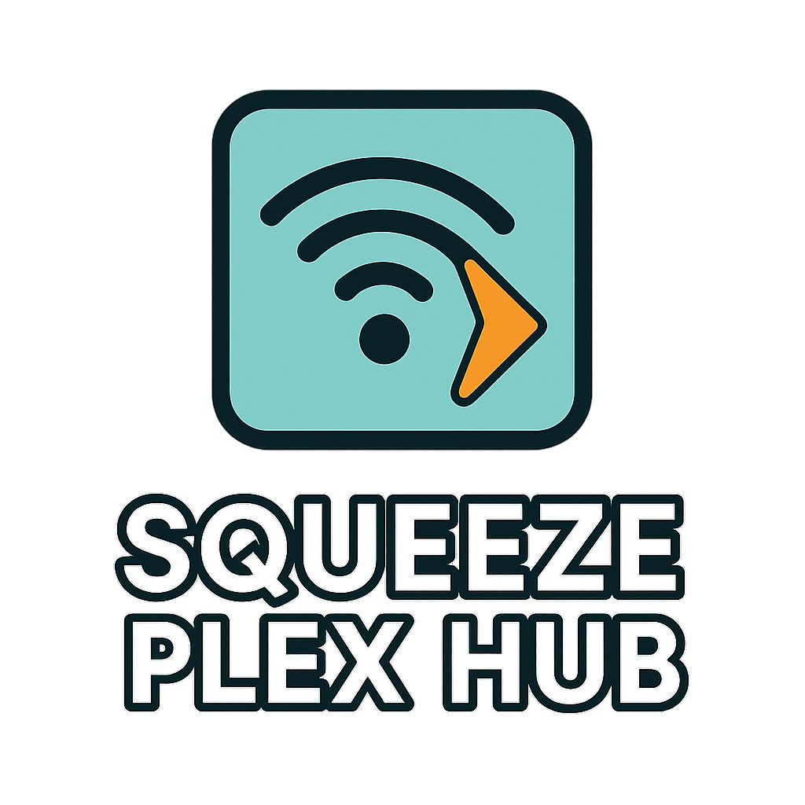
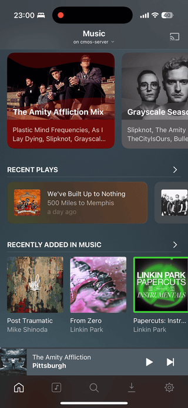
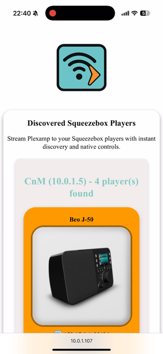

<div align="center">


<h3>Stream Plexamp to your Squeezebox players with instant discovery and native controls.</h3>

<p>
<a href="https://codecov.io/gh/onmomo/squeeze-plex-hub" target="_blank" rel="noopener noreferrer"></a>
<a href="https://github.com/sponsors/onmomo" target="_blank" rel="noopener noreferrer"></a>
</p>

<p>
<a href="https://lyrion.org" target="_blank" rel="noopener noreferrer">🔊 Lyrion</a> &bull;
<a href="https://www.plex.tv/plexamp" target="_blank" rel="noopener noreferrer">⏯️ Plexamp</a> &bull;
<a href="https://www.cmos.blog/?p=1014" target="_blank" rel="noopener noreferrer">🌐 Project Page</a>
</p>

<h3>See how it works.</h3>
<p>


</p>
</div>

# Squeeze Plex Hub

Squeeze Plex Hub bridges Plexamp (Plex) with your Logitech / Lyrion Music Server ecosystem so you can play Plex audio on Squeezebox (and compatible) players.

## Features

- Discovers LMS instances and attached Squeeze players automatically
- Advertises discovered Squeeze players to Plexamp so they appear as selectable targets with full Plexamp controls
- Enables multi-room audio playback using Squeezebox players controlled by Plexamp
- Shows player and server metadata
- Simple Docker-based deployment

## Requirements

- Running Lyrion Music Server (formerly Logitech Media Server) with at least one connected player
  - LMS JSON/CLI interfaces enabled (default)
- Plex Media Server with your audio library to stream from. No further media required on Lyrion Music Server
- Plexamp client (desktop or mobile) signed into the same Plex account
- Network: Squeeze Plex Hub must reach both LMS and Plexamp clients (usually same LAN)

## Run Squeeze Plex Hub

You can:

1. Use the provided Docker image on **Linux** (see command below). The image is published for amd64 and arm64 platforms.

```sh
docker run -d \
   --network host \
   --name squeeze-plex-hub \
   onmomo/squeeze-plex-hub:latest
```

2. Or build and run locally for development or production (MacOS / Windows):
   - For development: `yarn install && yarn dev`
   - For pre-production: `yarn build && yarn start`

After start:

1. Navigate to `http://localhost:3000` in your browser to access the Squeeze Plex Hub web interface.
2. The application will display all discovered Squeezebox players and Lyrion Music Server (formerly Logitech Media Server), along with their metadata. Use the interface to confirm which Squeezebox players can be controlled via Plexamp.
3. Use Plexamp to target discovered Squeezebox players.

No Plex credentials are ever stored. The app discovers LMS and Plex services on your local network only, and when initiating playback it forwards the Plex token so the Squeezebox player can stream directly from your Plex Media Server. The token is not persisted and expires after some time.

## Troubleshooting

* Please check the Squeeze Plex Hub logs for any errors, the logging is quite extensive.
* Enable the debug logs, for detailed insights: `NITRO_LOG_LEVEL=debug`.


### Squeeze players not found in Plexamp:
  1. Verify any Squeezebox player is connected and available in Lyrion / LMS first.
  2. Check Squeeze Plex Hub (http://localhost:3000) dashboard and confirm both LMS and Squeezebox players are shown. If nothing is shown, ensure Squeeze Plex Hub can connect to Lyrion / LMS and that the Lyrion CLI is enabled.
3. Check for port conflicts by reviewing the Squeeze Plex Hub startup logs for any discovery or network errors. This is especially important if both Squeeze Plex Hub and Plex Media Server are running on the same host. Squeeze Plex Hub requires exclusive access to UDP port 32412 to handle GDM network discovery requests from Plex clients. If Plex Media Server is also binding to this port, it may cause conflicts—Plex typically falls back to other ports in the range (32410, 32412, 32413, 32414). To resolve this, remove port 32412 from Plex Media Server if possible. If TCP port 3000 is already in use, you can publish a different host port (e.g., `docker run -p 8080:3000 ...`) and access the app at `http://localhost:8080`. For more details on proper container deployment and networking, refer to the Container Networking section below.
  - Docker Desktop on **MacOS**: GDM network discovery may not work with Docker Desktop on MacOS due to limitations with containers receiving UDP broadcast requests from the host network even if the container is running in **host network mode**. For full functionality in a container, run Docker on Linux.
  4. Ensure no local firewall blocking UDP ports 32412
  4. If still not available, abort Plexamp app to trigger device re-discovery.

### General
- Resume fails after some time with a 401: the Plex token expired. Reload the playlist in Plexamp for the Squeezebox player to refresh the token.

## Known Issues

- Plex Web player: The app handles device advertisement and timeline updates differently than Plexamp. Squeeze Plex Hub works, but with limited capabilities. For the best experience, use Plexamp.
- Album artwork not showing on the Squeezebox display: Current LMS limitation; reading artwork from stream isn’t supported for Plex audio streams.

## Project Structure

```
squeeze-plex-hub
├── app
│   ├── components      # Vue components for application pages
│   │   └── DiscoveredDevices.vue
│   └── pages           # Application pages
│       └── index.vue   # Main page of the application
├── public              # Static files served directly
├── server              # Backend logic and API routes
├── middleware          # Middleware logic
├── nuxt.config.ts      # Nuxt configuration file
├── vitest.config.ts    # Vite test configuration for unit and nuxt tests
├── tsconfig.json       # TypeScript configuration file
├── package.json        # npm configuration file
└── README.md           # Project documentation
```

## Dev Setup Instructions

1. Clone the repository:

   ```
   git clone https://github.com/onmomo/squeeze-plex-hub.git
   ```

2. Navigate to the project directory:

   ```
   cd squeeze-plex-hub
   ```

3. Install dependencies using Yarn:

   ```
   yarn install
   ```

4. Run the development server:
   ```
   yarn dev
   ```

## Container Build Instructions

To build the application in a container using Docker:

1. Build the Docker image:

   ```
   docker build -t squeeze-plex-hub . --build-arg APP_VERSION=1.2.3
   ```

   Check the `Dockerfile` for all supported build arguments.

2. Run the container:
   ```
   docker run --rm --network host squeeze-plex-hub

   > **Note:** For full functionality, Squeeze Plex Hub must be run with Docker's `host` network mode. Host networking allows all Plexamp devices on your local network to discover Squeeze Plex Hub players via UDP broadcasts. If you use Docker's default bridge network, only Plex players or Plex Server running within the same bridge network can discover Squeeze players.
   ```

The application will be available at `http://localhost:3000`.

Alternatively, use the published multi-arch image: `onmomo/squeeze-plex-hub:latest`

### Container Networking
Squeeze Plex Hub listens for UDP broadcast on port `32412` from Plex clients and responds with the discovered players. Therefore, it is essential that it can receive these UDP requests on that specific port.
- For best results, run the Plex Server container in either `host` or `bridge` network mode, and **always** run Squeeze Plex Hub in `host` network mode. This ensures Plexamp clients on mobile devices connected to your local network can discover Squeezebox players. Docker does not forward UDP packages from the host network (e.g. mobile devices) to the bridge network.
- **Important:** If Plex Server is in `host` mode, always start Squeeze Plex Hub before Plex Server so it can bind to UDP port `32412`. If Plex Server starts first and binds this port, Squeeze Plex Hub will not work.
- In `bridge` mode, do **not** bind UDP port `32412` for Plex Server, then the startup order does not matter; it will automatically fallback to other available UDP ports.

## Disclaimer  

**Squeeze Plex Hub** is an independent, open source project and is **not affiliated with, endorsed by, or officially supported by Plex, Plexamp, Logitech, or Slim Devices**.  
All product names and trademarks are the property of their respective owners.

## License

This project is licensed under the MIT License.

## Support the Project  

Squeeze Plex Hub is developed and maintained in my spare time.  
If you find it useful and want to support further development, please consider sponsoring me on GitHub:  

👉 [GitHub Sponsors](https://github.com/sponsors/onmomo)
