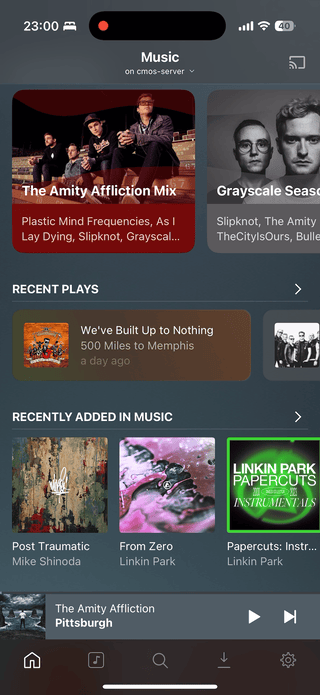
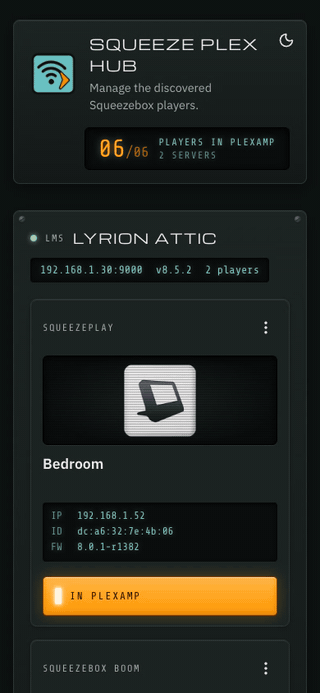

<div align="center">


<h3>Stream Plexamp to your Squeezebox players with instant discovery and native controls.</h3>

<p>
<a href="https://codecov.io/gh/onmomo/squeeze-plex-hub" target="_blank" rel="noopener noreferrer"></a>
<a href="https://hub.docker.com/r/onmomo/squeeze-plex-hub/tags" target="_blank" rel="noopener noreferrer"></a>
<a href="https://github.com/sponsors/onmomo" target="_blank" rel="noopener noreferrer"></a>
</p>

<p>
<a href="https://github.com/onmomo/lms-squeeze-plex-hub" target="_blank" rel="noopener noreferrer">🧩 LMS Squeeze Plex Hub Plugin</a> &bull;
<a href="https://lyrion.org" target="_blank" rel="noopener noreferrer">🔊 Lyrion</a> &bull;
<a href="https://www.plex.tv/plexamp" target="_blank" rel="noopener noreferrer">⏯️ Plexamp</a> &bull;
<a href="https://www.cmos.blog/?p=1014" target="_blank" rel="noopener noreferrer">🌐 Project Page</a>
</p>

<h3>See how it works.</h3>
<p>


</p>
</div>

# Squeeze Plex Hub

Squeeze Plex Hub bridges Plexamp (Plex) with your Logitech / Lyrion Music Server ecosystem so you can play Plex audio on Squeezebox (and compatible) players.

## Features

- Discovers LMS instances and attached Squeeze players automatically
- Advertises discovered Squeeze players to Plexamp so they appear as selectable targets with full Plexamp controls
- Enables multi-room audio playback using Squeezebox players controlled by Plexamp
- Dashboard to choose which players show up in Plexamp, e.g. to hide players you never play to from Plexamp
- Stereo pairs: sync two (mono) players as left and right speaker and control them as one player in Plexamp
- Shows player and server metadata
- Simple Docker-based deployment
- Full track metadata support on LMS in combination with the [LMS Squeeze Plex Hub Plugin](https://github.com/onmomo/lms-squeeze-plex-hub)

## Requirements

- Running Lyrion Music Server (formerly Logitech Media Server) with at least one connected player
  - LMS JSON/CLI interfaces enabled (default)
  - (optional) Enable the [LMS Squeeze Plex Hub Plugin](https://github.com/onmomo/lms-squeeze-plex-hub) to get full track metadata support on LMS
- Plex Media Server with your audio library to stream from. No further media required on Lyrion Music Server
- Plexamp client (desktop or mobile) signed into the same Plex account
- Network: Squeeze Plex Hub must reach both LMS and Plexamp clients (usually same LAN)

## Run Squeeze Plex Hub

You can:

1. Use the provided Docker image on **Linux** (see command below). The image is published for amd64 and arm64 platforms.

```sh
docker run -d \
   --network host \
   --name squeeze-plex-hub \
   -v /srv/squeeze-plex-hub/config:/app/config \
   onmomo/squeeze-plex-hub:latest
```

The volume keeps your [settings](#persist-settings) when the container is recreated (e.g. on image updates).

2. Or build and run locally for development or production (MacOS / Windows):
   - For development: `yarn install && yarn dev`
   - For pre-production: `yarn build && yarn start`

After start:

1. Open `http://localhost:3000` in your browser to access the [dashboard](#dashboard).
2. Check that your Lyrion Music Server and its Squeezebox players are listed, and hide players you don't want to see in Plexamp.
3. Use Plexamp to target discovered Squeezebox players.

No Plex credentials are ever stored. The app discovers LMS and Plex services on your local network only, and when initiating playback it forwards the Plex token so the Squeezebox player can stream directly from your Plex Media Server. The token is not persisted and expires after some time.

## Dashboard

Open `http://localhost:3000` to see your Lyrion Music Servers and their players. Each player has an **In Plexamp** key,
lit while Plexamp can see the player. Press it to hide players you never play to from Plexamp, and press it again in
*Hidden players* to bring them back. Every change can be undone right away.

### Stereo pairs

Squeezebox Radios and other mono speakers can play as a stereo pair. Choose **Pair as stereo…** in the menu of a player,
pick the partner and which one plays the left channel. Squeeze Plex Hub syncs both players in Lyrion and sets their
*Output channel* to left and right, Plexamp then sees the pair as one player. Use **Dissolve stereo pair** to undo it.
Both players must be on the same Lyrion server and offer the *Output channel* setting in their Lyrion audio settings
(Squeezebox 2 and newer, e.g. Radio, Touch, Boom, Receiver, Transporter and Squeezelite). Keep the pair on a stable network, a few milliseconds of sync drift shifts the stereo image.

The dashboard refreshes on its own. If Plexamp still lists a hidden player, restart Plexamp.

### Persist settings

Your choices are stored in `config/settings.json` relative to the working directory (`/app/config/settings.json` in the
Docker image). Without a volume or bind mount for `/app/config`, the settings are lost when the container is recreated.

```yaml
# docker-compose.yml
services:
  squeeze-plex-hub:
    image: onmomo/squeeze-plex-hub:latest
    network_mode: host
    restart: unless-stopped
    volumes:
      - ./config:/app/config
```

The file is plain JSON and can be edited by hand while Squeeze Plex Hub is stopped. Players are keyed by their player ID
(the MAC address shown on the dashboard), names are managed in LMS:

```json
{
  "version": 1,
  "players": {
    "00:04:20:2a:11:04": { "hidden": true }
  },
  "pairs": {
    "00:04:20:2a:11:01": { "name": "Kitchen", "leftId": "00:04:20:2a:11:01", "rightId": "00:04:20:2a:11:02" }
  }
}
```

Make sure the directory is writable for the container, otherwise the dashboard shows an error when you change a player.

## Troubleshooting

* Please check the Squeeze Plex Hub logs for any errors, the logging is quite extensive.
* Enable the debug logs, for detailed insights: `NITRO_LOG_LEVEL=debug`.

### Run it without Docker

On the device the project should be executed:
1. git clone https://github.com/onmomo/squeeze-plex-hub.git
2. yarn install && yarn start

### Squeeze players not found in Plexamp:
  1. Verify any Squeezebox player is connected and available in Lyrion / LMS first.
  2. Check Squeeze Plex Hub (http://localhost:3000) dashboard and confirm both LMS and Squeezebox players are shown, and that the player's In Plexamp key is lit (not in *Hidden players*). If nothing is shown, ensure Squeeze Plex Hub can connect to Lyrion / LMS and that the Lyrion CLI is enabled.
3. Check for port conflicts by reviewing the Squeeze Plex Hub startup logs for any discovery or network errors. This is especially important if both Squeeze Plex Hub and Plex Media Server are running on the same host. Squeeze Plex Hub requires access to UDP port 32412 to handle GDM network player discovery requests from Plex clients. If PMS is running on the same host or docker host network, both services should be able to use UDP 32412. If PMS is running in Docker bridge mode, remove port 32412 from its port mapping. If TCP port 3000 is already in use, you can publish a different host port (e.g., `docker run -p 8080:3000 ...`) and access the app at `http://localhost:8080`. For host networking, the announced HTTP port automatically follows Nuxt/Nitro port configuration in this order: `NITRO_PORT`, then `PORT`, then default `3000`. For more details on proper container deployment and networking, refer to the Container Networking section below.
  - Docker Desktop on **MacOS**: GDM network discovery may not work with Docker Desktop on MacOS due to limitations with containers receiving UDP broadcast requests from the host network even if the container is running in **host network mode**. For full functionality in a container, run Docker on Linux.
  4. Ensure no local firewall blocking UDP ports 32412
  4. If still not available, abort Plexamp app to trigger device re-discovery.

### General
- Resume fails after some time with a 401: the Plex token expired. Reload the playlist in Plexamp for the Squeezebox player to refresh the token.

## Known Issues

- Plex Web player: The app handles device advertisement and timeline updates differently than Plexamp. Squeeze Plex Hub works, but with limited capabilities. For the best experience, use Plexamp.

## Project Structure

```
squeeze-plex-hub
├── app
│   ├── assets/css      # Theme (fonts, colors, rack styling)
│   ├── components      # Dashboard components
│   │   ├── PlayerDashboard.vue  # Header, status display, server list
│   │   ├── ServerSection.vue    # One LMS panel with its players and hidden players section
│   │   └── PlayerCard.vue       # One player with its In Plexamp key
│   ├── composables     # usePlayerDashboard: polling and player settings
│   └── pages           # Application pages
│       └── index.vue   # Main page of the application
├── config              # User settings (created at runtime, not in git)
├── public              # Static files served directly
├── server              # Backend logic and API routes
├── middleware          # Middleware logic
├── nuxt.config.ts      # Nuxt configuration file
├── vitest.config.ts    # Vite test configuration for unit and nuxt tests
├── tsconfig.json       # TypeScript configuration file
├── package.json        # npm configuration file
└── README.md           # Project documentation
```

## Dev Setup Instructions

1. Clone the repository:

   ```
   git clone https://github.com/onmomo/squeeze-plex-hub.git
   ```

2. Navigate to the project directory:

   ```
   cd squeeze-plex-hub
   ```

3. Install dependencies using Yarn:

   ```
   yarn install
   ```

4. Run the development server:
   ```
   yarn dev
   ```

5. Or run the dashboard in demo mode with fake Lyrion servers and players, no hardware or network discovery needed
   (settings go to `config/settings.demo.json`):
   ```
   yarn dev:demo
   ```

   The dashboard loads player images from Lyrion. To see the real model images in demo mode, start a Lyrion container
   and point the demo at it (the images stay in Lyrion, the demo players keep their fake addresses otherwise):
   ```
   docker run -d --rm --name lyrion-demo -p 9000:9000 lmscommunity/lyrionmusicserver
   NUXT_DEMO_LMS=localhost:9000 yarn dev:demo
   ```
   Lyrion has images for Squeezebox models (Touch, Radio, Boom, SqueezePlay, …). Players without one, like Squeezelite,
   show a speaker icon. Stop the container with `docker stop lyrion-demo`.

## Container Build Instructions

To build the application in a container using Docker:

1. Build the Docker image:

   ```
   docker build -t squeeze-plex-hub . --build-arg APP_VERSION=1.2.3
   ```

   Check the `Dockerfile` for all supported build arguments.

2. Run the container:
   ```
   docker run --rm --network host -v "$PWD/config:/app/config" squeeze-plex-hub

   > **Note:** For full functionality, Squeeze Plex Hub must be run with Docker's `host` network mode. Host networking allows all Plexamp devices on your local network to discover Squeeze Plex Hub players via UDP broadcasts. If you use Docker's default bridge network, only Plex players or Plex Server running within the same bridge network can discover Squeeze players.
   ```

The application will be available at `http://localhost:3000`.

Alternatively, use the published multi-arch image: `onmomo/squeeze-plex-hub:latest`

### Container Networking
Squeeze Plex Hub listens for UDP broadcast on port `32412` from Plex clients and responds with the discovered players. Therefore, it is essential that it can receive these UDP requests on that specific port.
- For best results, run the Plex Server container in either `host` or `bridge` network mode, and **always** run Squeeze Plex Hub in `host` network mode. This ensures Plexamp clients on mobile devices connected to your local network can discover Squeezebox players. Docker does not forward UDP packets from the host network (e.g. mobile devices) to the bridge network.
- **Important:** If Plex Server is in `host` mode, always start Squeeze Plex Hub before Plex Server so it will always bind to UDP port `32412`. If Plex Server starts first and binds this port, Squeeze Plex Hub will eventually not work and crash.
- In `bridge` mode, do **not** bind UDP port `32412` for Plex Server, then the startup order does not matter.
- In `host` mode, set `-e NITRO_PORT=3001` to run the container on a different port.

## Disclaimer  

**Squeeze Plex Hub** is an independent, open source project and is **not affiliated with, endorsed by, or officially supported by Plex, Plexamp, Logitech, or Slim Devices**.  
All product names and trademarks are the property of their respective owners.

## License

This project is licensed under the MIT License.

## Support the Project  

Squeeze Plex Hub is developed and maintained in my spare time.  
If you find it useful and want to support further development, please consider sponsoring on GitHub:  

👉 [GitHub Sponsors](https://github.com/sponsors/onmomo)
